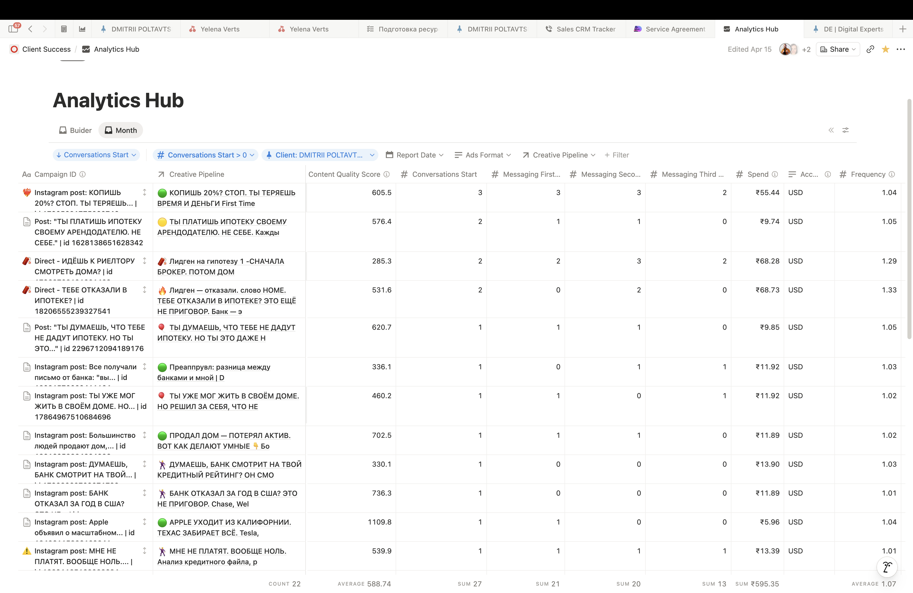
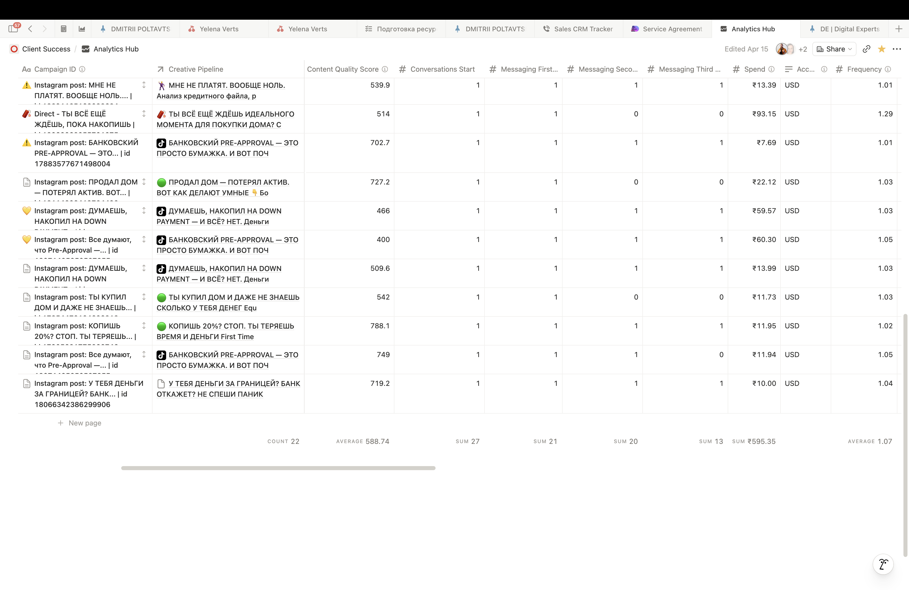
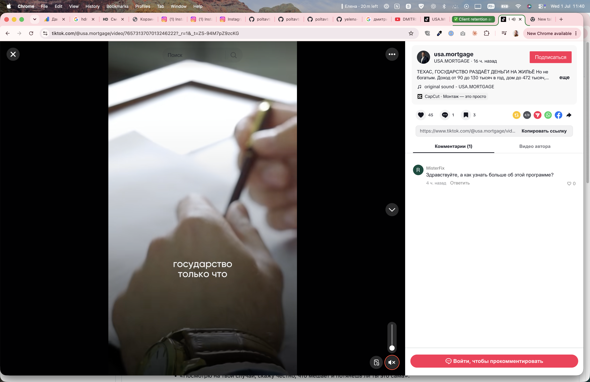

# Дмитрий Полтавцев · Mortgage — отчёт по стратегии и результатам

- **Период:** февраль–июнь 2026
- **Активный контент:** с марта (4 месяца)

> Сначала поправка по срокам: контракт с февраля, но активный контент идёт **с марта — это 4 месяца, а не 6**. До этого — онбординг, исследование ниши и конкурентов, подготовка.
>
> И ещё: **отчёта за июнь пока нет** — мы его сводим после 5 числа. Поэтому все цифры ниже — фактически за **3 месяца (март–май)**; с июнем результат будет больше.

---

## 1. Результаты — что уже сделано (в цифрах)

За март–май реклама дала воронку переписки:

> ### 27 начато переписок → 21 первый ответ → 20 второй → 13 третий ответ

То есть **20 человек продолжили переписку дальше второго ответа, а 13 довели диалог до третьего сообщения** — это многошаговое общение, а не «кликнул и пропал». Данные из кабинета Facebook-аналитики.

И это **нижняя граница**, по факту переписок больше:
- **Facebook всегда занижает** — он физически видит не все диалоги;
- часть людей увидела рекламу и написала/позвонила **по другим каналам** (прямой директ, сарафан, органика) — такие обращения рекламе **не атрибутируются**, и точно посчитать их не может никто. Больше того — люди часто и **сами не связывают** своё обращение с рекламой: спроси «откуда узнал?» — пожмёт плечами. Но закономерность простая: **стоит отключить рекламу — и таких обращений по всем каналам становится меньше**, хотя напрямую их с рекламой никто не связывал.

**Выгрузка по перепискам (данные из рекламного кабинета Facebook, просто сведены в Notion):**

&nbsp;&nbsp;

<i>Внизу таблиц — итоговые суммы: 27 · 21 · 20 · 13.</i>

### 1.1. Что дало диалоги — по гипотезам и форматам

Считали не лайки, а кто реально пишет. Вот что дало переписки и почём (март–май; распределение по гипотезам — по смыслу креативов):

| Гипотеза (боль) | Диалогов | Цена за диалог |
|---|---:|---:|
| Г2 · Взнос 20% / «сколько реально нужно» | 5 | $1,9–5,4 |
| Г8 · Дом как актив (equity, HELOC) | 4 | $0,8–2,2 |
| Г9 · Аренда = чужая ипотека | 3 | $1,6–2,4 |
| Г3 · Нестандартная ситуация / «банк отказал» | 3 | $2–3,2 |
| Г7 · Растущий Техас (Даллас, Apple → Техас) | 2 | $2,2–2,5 |
| Г1 · Сначала брокер / Pre-Approval | 2 | $2–6,5 |
| Г5 · Деньги за границей / крипта | 1 | $2 |
| Г10 · Как банк реально считает (DTI) | 1 | $2,7 |
| Общие темы (ставки, новости, застройщик) | 4 | $1,4–2,1 |
| **Прямой DM-лидген (отдельные «Direct»-кампании)** | ~5 | **$11–32** |

**Разрез по формату:**

| Формат | Доля диалогов | Что это значит |
|---|---:|---|
| **Рилы** | ~3/4 (≈23) | рабочая лошадка — почти все переписки идут отсюда |
| **Карусели** | ~1/4 (≈8) | поддерживают, дают часть самых дешёвых диалогов ($0,8–2,2) |

Три вывода:
- **переписка из контента стоит $2–5**, и довести человека до 2–3-го ответа стоит **почти столько же**, сколько до первого: кто ответил — тот идёт вглубь. Это говорит о высокой релевантности контента запросу аудитории — то есть о его качестве;
- **и рилы, и карусели дают результат** — работают в паре;
- **прямой DM-лидген-тест вышел неэффективным ($11–32 за диалог)** — разбираю ниже в разделе про «5 лидов».

> И сразу проговорю, чтобы не было иллюзий: мы прекрасно понимаем, что **реальная стоимость лида складывается из совокупных расходов на маркетинг**, а не из цены одной переписки. Цифры выше — **промежуточные**: это результаты тестов, по которым мы видим, что работает и даёт результат. Именно эти рабочие связки мы и собираемся масштабировать в полноценную воронку.

И контент реально работает:

- его **кликают выше нормы и по недвижимости, и по финансам** (CTR рилов ~3%, каруселей ~5,3% против [1,68% в недвижимости и 0,98% в финансовой Facebook-рекламе, США 2025](research-appendix.md#11-бенчмарки-кликабельности-и-охвата-контента)),
- «мёртвых» роликов и каруселей практически нет, а рилы держат внимание,
- подробно, с цифрами и сравнением с рынком сделали отдельный отчёт: [эффективность контента](content-effectiveness.md).

Ощущение «одно и то же по кругу» возникает из-за **системной докрутки контента до результата**. Со стороны ролики на одну JTBD похожи — потому что JTBD одна и та же. Но между заходами меняется главное — **смысловая конструкция**.

Цикл такой: берём контент → запускаем дешёвым тестом (обычно ~$10 на заход, 5–6 дней) → снимаем **посекундную карту смыслов** → видим, какая часть держит людей, а какая теряет → в следующем заходе перестраиваем смысловую конструкцию: слабые смыслы заменяем, сильные сохраняем и усиливаем. Это не «повтор» — это управляемая работа со смыслами, с чтением данных между заходами. [Подробно в отчёте](content-effectiveness.md#3-докрутка--как-мы-улучшаем-по-одной-теме).

То есть контент — **не слабое место, а сильное**. И это результат системной работы, которую ты у нас и купил.

### 1.2. Бюджет (точные данные кабинета)

| Месяц | Продвижение (прогрев) | Лидген | Итого |
|---|---:|---:|---:|
| Март | $344 | — | $344 |
| Апрель | $856 | **$357** | $1 213 |
| Май | ~$468 | — | ~$468 |
| Июнь | $397 | — | $397 |
| **Итого** | | | **≈ $2 400** |

### 1.3. Откуда взялись «5 лидов»

На прямой лидген ушло **$357 (15% бюджета)**. Напомню, что ты хотел потратить на этот тест $1000 — но мы очень быстро пришли к выводам и стопнули.

«5 лидов» — это **одна строка** отчёта: лидген-кампания, **апрель, $357 → 380 кликов → 5 лидов → $71,40 за лид**. То есть «5 лидов за полгода» = **5 лидов из теста прямого лидгена в нарушение технологии** (но сейчас он нам очень в тему пришёлся — об этом дальше): без сайта, без прогрева, в лоб, в директ.

**Результаты и выводы этого теста:**

1. Мы получили аналитику по гипотезе **привлечения риелторов** — и зарубили её по результату. Но это побочный результат.
2. Главный вывод — **прямой холодный лидген не работает**.
3. По технологии и рекомендации FB нужно набрать ~50 событий. **Почему отключили раньше?** Наш опыт по поведению кампаний: мы по совокупности метрик видим, как кампания развивается в первые дни, и когда вероятность, что она «разгонится», низкая — отключаем, чтобы не сливать бюджет. Это ложится на исследования: в доверительных нишах прямой лидген «в лоб» по холодной аудитории работает хуже прогрева — [Binet & Field, анализ 996 кейсов, и отраслевые гайды по ипотечному лидгену](research-appendix.md#1-прогрев-доверия-до-лидгена).
4. **Бюджет.** $357 для лидген-кампании — мало: чтобы алгоритм обучился, нужно ~50 целевых событий в неделю — [официальное правило Meta по выходу из фазы обучения](research-appendix.md#2-бенчмарки-meta-лидгена). Можно, конечно, убиться об стену и доплатить за полное обучение алгоритма — это ~**$3,5к** (≈50 событий в неделю по $71). Но смысла нет: и наш опыт, и чужие результаты в нише уже показывают, куда идти. Дешевле и умнее — делать прогрев и вести лидген **на сайт**, а не кормить Цукерберга.
5. Напомню: этот заход на быстрый лидген мы делали по твоей инициативе — это был выстрел наугад. Я сразу сказал: шанс выстрелить есть, но вероятность ~90%, что будет пусто. Так и вышло. Теперь знаем точно: **попытка в лоб налидгенить в твоей нише проваливается**. И если честно — спасибо, что предложил этот тест в апреле: без него мне бы сейчас пришлось доказывать «по моему опыту это не работает» на словах, а так у нас есть живой тест на твоём проекте.

### 1.4. Кросспостинг — YouTube и TikTok

Тот же контент живёт на YouTube и в TikTok и собирает **органический отклик**:

- **YouTube** (@USAMortgage): 57 роликов, у каждого **~1 000 просмотров** при всего **38 подписчиках** — то есть YouTube раздаёт контент **далеко за пределы твоей базы**. Пример Shorts: **1080 просмотров, 7 лайков**, комментарии.
- **TikTok** (@usa.mortgage): просмотры роликов от ~120 до ~1 000+, лайки **30–45**, **сохранения до 18** (сохранение = высокая ценность для зрителя).

Реклама у нас крутится **только в Мете**. В YouTube и TikTok те же ролики просто **бесплатно кросс-постятся** — дёшево и сердито. Это не отдельные каналы привлечения, а **поддерживающие касания**: человек, которого мы коснулись в Инсте или Fb, встречает тебя ещё и там, и эти повторные касания в разных местах **укрепляют доверие и узнаваемость** — то есть работают на усиление.

Механика подтверждается: кросс-постинг создаёт [«эффект вездесущности» и ускоряет узнавание](research-appendix.md#9-мультиканальность-и-кросс-платформенные-касания), а платная омниканалка на 3+ каналах поднимает отклик в разы — часть этого мы получаем бесплатно.

Мы сейчас не занимаемся отстраиванием воронки и промоушном в YouTube и TikTok — это **осознанная последовательность**, а не «пофиг, че там у нас постится в ютуб и тик-ток». Мы ещё достраиваем воронку в Инсте — а масштабировать в других каналах то, что ещё не достроено, нельзя: получится как с апрельским лидген-тестом. Поэтому сейчас: **Мета + бесплатные перепосты** и те бонусы от мультиканальности, которые они дают. А когда воронка отстроена и подтверждена — разворачиваем её и в других каналах **уже с платным промоушеном**, чтобы забрать многоканальный прирост эффективности ([до +287% по данным омниканальных кампаний](research-appendix.md#9-мультиканальность-и-кросс-платформенные-касания)).

Следующие этапы — YouTube (а YouTube — это реклама **Google**) и TikTok со своим платным продвижением. Там настройка **гораздо серьёзнее, чем у Меты**: свои интеграции, аналитика, дедупликация и обучение алгоритмов. Мы будем **пробрасывать аналитику между площадками** — и вот тут начнётся **настоящая кросс-платформенность** и тот самый кратный рост эффективности (~+287% из омниканальных данных). Но до этого этапа надо **сперва дожить** — достроив и отладив базу на Мете. Всё по очереди.

Под роликом про техасскую программу помощи — **прилетел лид**, случайно его заметил сегодня, когда отчёт собирал: *«Здравствуйте, а как узнать больше об этой программе?»* Из контента без всякой рекламы — приятный бонус, периодически случается.

<i>TikTok: 45 лайков, 3 сохранения и вопрос-заявка «как узнать больше об этой программе?».</i>

---

## 2. Наша стратегия — что делали, зачем и что дальше

### Как мы строим контент

Прописали на старте **JTBD-гипотезы** (и продолжаем их корректировать) — конкретные «работы» и боли аудитории. И берём их не из пальца, а на двух основаниях:

- **исследование рынка** — [та большая таблица](https://docs.google.com/spreadsheets/d/1SESdSLG7W6Zi9sMmKrtLg3_FzTSpmjHXfcVmXtEPVdo/edit?gid=1898893593#gid=1898893593), которую мы разрисовывали;
- **реальные голоса аудитории** — [дословные цитаты](audience-voices.md) с форумов иммигрантов: что люди обсуждают, какие вопросы задают, чего боятся. Регулярно обновляемые данные с рынка.

Дальше на каждую гипотезу делаем контент: берём тему (из таблицы и/или с рынка), **ты записываешь её раскрытие своим голосом** и дальше по процессу — ты всё это знаешь, — упаковываем в два формата: **рил и карусель**.

Каждая единица идёт на продвижение с **минимальным недельным бюджетом**, собираем аналитику. И по результату:
- тема/гипотеза провалилась — **больше её не трогаем**;
- зашла — смотрим, что улучшить, и **запускаем по новой**.

### Почему кажется, что «одни и те же темы по кругу»

Тут и возникает передоз работы над контентом — «одни и те же темы по кругу, сколько можно, мы это уже миллион раз записывали, слушать невозможно, записывать невозможно». Ну да… Но, к сожалению, это и есть **та самая работа над маркетингом, которая даёт результат** — во всяком случае на старте. Может быть, это не так весело и задорно, как снимать игровые или юморные рилы, — но это ровно то, что работает. Занудно, но системно.

Я, видимо, недооценил боль, которую это у тебя вызывает. Мне жаль, что заставил тебя так страдать, правда. Хорошая новость — **худшее позади**. И есть несколько вариантов, как это оптимизировать (и это не HeyGen).

### Зачем прогрев, а не «закрытие в лоб» с первого дня

Пока контент крутится — идёт **прогрев**: аудитория тебя видит и привыкает. Прогреваем не просто так, а чтобы потом перевести этих людей на следующий шаг воронки — на закрытие. Прогрев буквально заключается в том, что люди видят тебя в течение длительного времени и ты разными словами говоришь им одно и то же. Это не всегда попадает точно в цель, так как мы тестируем. Но большей частью — да.

«А нельзя сразу закрывать?» — мы это проверили: попробовали лобовое закрытие уже через месяц прогрева (тот самый апрельский лидген). Не получилось — и мы продолжили по стратегии. Теперь это знаем на цифрах.

### Почему пока без ретаргетинга

Почему не крутим контент повторно на тех, кого уже собрали? Потому что **на этапе прогрева это не работает**. Ретаргет по той же аудитории — это просто платить Facebook в ~4 раза дороже без смысла. Ретаргетинг имеет смысл только для **лидогенерящих кампаний** — и вот там мы его обязательно включим, на этапе закрытия.

А на контентном этапе мы и так работаем по относительно небольшой русскоязычной аудитории — наши креативы видят одни и те же люди. Мы держим **частоту в районе 1–1,5** показа на человека на одну единицу контента. Это не лучшие показатели для прогревочных кампаний — лучше было бы 2–2,5, — но тогда у нас искажались бы данные по аналитике, а на этапе тестов чистые цифры важнее. При переходе к лидгену бюджет уже нужно повышать, чтобы частота показов выросла. Я как раз этот вопрос хотел согласовать перед созвоном — писал в чат.

### Сколько нужно времени на прогрев

По нашему опыту и по данным рынка ([эффект прогрева проявляется примерно с 3-го месяца](research-appendix.md#6-сколько-времени-нужно-прогреву-чтобы-появился-эффект)): чтобы прогрев дал эффект — чтобы люди привыкли и начали тебя замечать — нужно **минимум 3 месяца**. Раньше эффекта почти нет: эти три месяца уходят на то, чтобы человек начал отмечать «о, этого парня я где-то уже видел, он не незнакомый».

Для тебя 3–4 месяца ощущаются как «я уже очень давно вкладываюсь, столько сделал — где результат?». А для аудитории это **только-только** начало: она едва начала тебя замечать. Напомню: март, апрель, май, июнь… — а кажется, что уже капец как много сделано, да?

А в иммигрантских сообществах доверие вообще строится годами: [владение жильём у иммигрантов растёт с 16% (в стране ≤5 лет) до 61% (21+ год)](research-appendix.md#8-доверие-и-свой-эксперт-в-иммигрантских-сообществах) — это косвенные данные (по латино-нише), но масштаб задают: 3–4 месяца узнавания — это только-только начало.

Мы выпускаем контент **4 месяца** (март–июнь) — на месяц дольше минимума. Я говорил об этом на старте: что это долгая системная работа. И мы подошли **ровно к той точке, о которой я предупреждал** — прошло минимальное время плюс чуть-чуть. Это не сбой, это запланированный момент перехода. Теперь надо начать делать немного другое.

### Контентные и продуктовые гипотезы — это разное

Важное уточнение. Тут немного ботаники, можно пропустить.

Мы называем гипотезами и JTBD-артефакты — Job Story и контексты. И тесты болей/тем/заходов. И тесты офферов. И тесты креативов — самый последний вид тестов, когда триггеры тестируем; мы как раз сейчас к этому подошли. Но по сути это всё разные вещи и разные этапы воронки.

И когда мы говорим «тестируем гипотезы», это может путать и создавать ощущение бессистемности. На самом деле это как раз **суперсистемная работа** — просто на каждом этапе она делается немного по-разному.

JTBD на контенте мы тестировали довольно долго — и, по сути, эта работа **закончена**. Мы про аудиторию уже знаем дофига: по каким гипотезам и с какими «работами» люди приходят, на что реагируют, что хотят читать и слушать. Вопросов про них у нас нет — мы ровно этим и занимались всё это время. *Now we know.*

Поэтому сейчас мы двигаемся **не с чистого листа**, а глубже внутри уже исследованной области: осталось перевести этих людей на следующий шаг воронки. И вот это важный момент — ты как раз об этом и говорил: если сейчас придёт другая команда, ей придётся начинать всю эту работу заново. А у нас она уже сделана. Маркетологи не берут результаты других маркетологов — все начинают с нуля.

### Где мы сейчас и что включаем

У нас есть всё: тесты, понимание аудитории, сайт. Пора переходить к гм… **тестам лидгена** — об этом я тебе сегодня и написал:

- **поднимаем бюджеты на прогрев**;
- **запускаем лидогенерящие кампании** — по той аудитории, которую уже прогрели.

Лидген теперь работает иначе: показываем более закрывающий контент, но приглашаем **не в директ, а на сайт**. Почему так:
- мы уже знаем, что этим людям заходит, на что они реагируют, их триггеры — и сайт сделан ровно под это;
- на сайте **аналитика глубже**, чем в переписках, — это сильно улучшает и обучение Facebook, и нашу собственную аналитику.

К этому моменту мы и готовились: строили сайт, гоняли тесты — большой объём работы ровно для того, чтобы запустить эту фазу. Сделано **5 лендингов под 5 гипотез** для лидгена. И скорее всего, будем их переделывать и делать ещё — для этого инструмент и создавали.

### Про аудит конкурентов

Ребята, делавшие аудит, по сути **правы**. Они посмотрели в аккаунт, но не смотрели в нашу стратегию, в наши исследования, в нашу аналитику — проанализировали рекламные кампании и не увидели закрывающую часть воронки. Не зная нашей стратегии и того, как мы действуем, они сделали абсолютно резонный вывод — я бы на их месте сделал точно такой же: «ребята просто льют трафик на аккаунт бессистемно, ничего с этим не делают, это бестолковая работа, никуда не ведущая; лидогенерацией не занимаются — а должны».

И вывод «надо делать лидген» — верный. Вопрос только в том, **как его делать, когда и какими методами**. Если в лоб — это не работает: мы уже видим это на цифрах, так как пробовали, и [Binet & Field и отраслевые данные](research-appendix.md#1-прогрев-доверия-до-лидгена) говорят о том же.

### Что планировали делать дальше

Следующий этап воронки — **закрытие**. Ту аудиторию, которую мы привели на интерес и держали на вовлечении, теперь нужно **конвертировать в действие**: перевести с процесса маркетинга на процесс продажи. По-простому — превратить их в лидов и вывести на тебя: отфильтровать тех, у кого есть потребность и кто хочет начать разговор о своём доме, и двигать дальше по воронке. Механика — та, что описана выше (кампании на тёплую аудиторию → сайт, подготовленный специально под это).

И важно: это **не** «грели-грели, а теперь давайте наугад запустим лидген — посмотрим, что будет». Маркетинговая часть продумана ровно на тех данных, что мы собрали. Ничего случайного здесь нет — проведена большая работа.

С первой лидген-кампании можем не попасть — может, со второй или третьей. Но **получится — это уже можно говорить уверенно**, потому что мы видим, как реагирует аудитория: сильные метрики вовлечённости на контенте (на том самом, от которого уже тошнит), переходы, отклик. Технология работает.

5 лендингов, 5 гипотез — какая-то выстрелит, может, после докрутки. И тогда у нас будет **отстроена вся воронка от начала до конца**: ведём людей → прогреваем → повышаем доверие → доводим до контакта. Они приходят к тебе **уже не холодными, они тебя знают** — это качественные лиды. К этому мы и шли. Так и было задумано.

Есть ли вероятность, что моя стратегия не сработает? Есть. Такая вероятность есть всегда. Но пока всё идёт точно как задумано — и точно так же, как шло на других проектах. Я не вижу системных проблем.

---

## 3. Сайт: что сделали

Я ещё не рассказывал, что у нас по сайту — он тебе достался как «ну сайт мы сделаем попозже». Типа небольшого бонуса. Но по факту — это **основа машинки, которую мы строим**, и мне хочется, чтобы ты увидел масштаб проделанной и запланированной работы.

**Фундамент маркетинга — это грамотный сайт, а не соцсети.** Соцсети — быстрый, но «арендованный» канал: перестал постить или платить — всё закончилось. Сайт — это **твоя собственная система**, в которую **сходится весь маркетинг**: сюда ведёт реклама, здесь стоят аналитика и пиксель (которые учат Мету), здесь работает SEO и GEO, копится органика, отсюда лиды пойдут в CRM, здесь живут автоматизации и лендинги под каждый заход. Грамотно сделанный сайт **собирает все каналы в один управляемый механизм** — и остаётся с тобой если не навсегда, то уж точно на годы.

Этот фундамент мы уже заложили на [**серьёзном инженерном уровне**](site.md). Посмотри отчёт.

Сайт — не визитка, а часть **закрывающей воронки**. Мы с самого начала планировали начать его на **2–3-й месяц** работы — ровно чтобы он опирался на **аналитику и уже полученный результат**, а не строился вслепую. По срокам прям чётенько сработали, как и планировали. Теперь это наш **конвертирующий инструмент**.

И у него есть вторая функция — **точка входа, трафик из поиска** (об этом ниже).

### Как шла работа над сайтом

Сайт и 4 лендинга — то, что мы построили под лидген. Хронология:

| Этап | Дата |
|---|---|
| Домен согласован (`mortgageservicepro.com`) | 19.02 |
| **Старт работ над сайтом** (после решения вопроса с доступом к домену) | **~16–22.04** |
| Сайт показан на согласование | 07.05 |
| Твой ответ: «в целом нравится», добавить белого, правки под compliance | 07.05 |
| Сайт в целом готов (блог, программы, юр-страницы) | 06.06 |
| Внесены все правки по сайту | 13.06 |
| Готовы 4 лендинга: pre-approval, аренда, texas, equity | 17.06 |

Старт пришёлся на **2–3-й месяц работы — как и планировали** (к этому же времени решился доступ к домену). **Активная сборка заняла ~5–6 недель** (с ~16–22.04 до «готов» 06.06), первую версию показали за ~2 недели.

**Сайт уже проиндексирован и по брендовому запросу стоит первым в Google** — выше твоих YouTube и Instagram:

<i>Google по запросу «Дмитрий Полтавцев брокер»: сайт mortgageservicepro.com — на 1-м месте.</i>

В Google Search Console видно, что сайт **уже собирает органические показы и клики по целевым коммерческим запросам** — первый запрос, что мы получили: «ипотечный брокер рядом со мной». **15 показов, 3 клика, CTR 20%, средняя позиция 12**.

<i>Google Search Console, mortgageservicepro.com: показы/клики и целевой запрос «ипотечный брокер рядом со мной».</i>

Абсолютные числа пока небольшие — сайт молодой, блог ещё не наполнили. Но сигнал сильный: сайт **проиндексирован и уже ранжируется по целевым запросам в регионе**, а не только по бренду, да ещё с CTR 20%.

И тут важна разница в горизонтах:
- **Контент в соцсетях — быстрый результат, но только пока его делаешь.** Перестал выпускать — он перестал работать.
- **Контент на сайте — это инвестиция:** до ощутимого результата ~год, зато дальше он работает долго. Даже если перестать наполнять, он ещё **2–3 года** будет приносить трафик.

Мы этот путь **уже начали** — первые органические показы и клики выше это подтверждают.

И поиск теперь — это не только Google: люди всё чаще спрашивают ChatGPT и Perplexity. Сайт под это уже оптимизирован — **GEO**: ИИ-краулерам явно открыт доступ, а все факты о тебе (кто, какие услуги, какие штаты) машиночитаемы. Вокруг GEO сейчас много спекуляций — «попадание в выдачу GPT» продают как секретную услугу; [что это на самом деле и что именно сделано у нас — в отчёте по сайту](site.md#-geo--оптимизация-под-ии-поиск-и-почему-вокруг-неё-столько-спекуляций).

---

## 4. Что зависло на твоей стороне — блокеры

### Фото

Один хвост висит с марта: **твои фото для контента и сайта.** Договаривались их сделать (02.03 и 05.03), в июне снова просил подобрать фото для главной (04.06) — но пока не получили. Хорошие фото усилят обложки, сайт и новый визуал. Как будут — сразу двинемся с оформлением.

### Вычитка юр-обвязки и лонгридов

Ещё один незакрытый хвост, и он **важный для compliance** (ипотека): я просил тебя вычитать **юридические страницы сайта** (Политика конфиденциальности, Условия использования, Cookies, право какого штата применяется — 05.06) и **лонгриды/статьи блога** («чек лонгридов» — 13.06, «надо прям вычитать и покритиковать, можно аудио» — 17.06). Ты и сам отмечал 07.05, что по текстам нужны правки под compliance. Пока не вычитано. В ипотеке это критично — просим закрыть, чтобы тексты были юридически чистыми.

**Невычитанные лонгриды тормозят процесс** — я приостановил продакшн и выкладку следующих статей, пока не вычитаны текущие. Я из этого не раздувал проблему, но по факту это **блокер** на твоей стороне.

### Доступ к CRM

Чтобы лиды с сайта **автоматически падали в твою CRM**, нужен доступ к ней — я просил его **05.06** («*могу посмотреть интеграцию в твою СРМ, чтобы туда сразу лиды падали — тогда нужен доступ*»). Доступа пока нет, поэтому CRM-интеграция (и завязанная на неё email-рассылка) стоит **«на очереди»**. Дашь доступ — настроим авто-передачу лидов и закроем последний кусок воронки.

---

## 5. Про автоматизацию и ИИ-аватар (стратегия конкурента)

**Почему это кажется сильной стратегией.** На первый взгляд подход мощный: без твоего участия делается много контента, он собирается на автомате из новостей и триггеров рынка — ну что тут может пойти не так? Тем более у нас есть релевантный тест: посты на общие темы (ставки, новости, застройщик) дали 4 диалога по **~$1,5–2** — один из самых дешёвых результатов за диалог. Так что идея выглядит абсолютно разумной.

Но именно для твоей ниши я считаю это **плохой стратегией**. Четыре причины.

### 1. Доверие — а аватар его обрушивает

В твоей нише главное возражение — **доверие**. Мы видим это и по [голосам аудитории](audience-voices.md), и на рынке, и по [исследованиям](research-appendix.md#4-ии-аватар-против-живого-личного-бренда), и по опыту в похожих нишах. А доверие аватаром не построить: как только человек понимает, что перед ним ИИ-аватар, доверие обрушивается. Это подтверждают данные — Deloitte: [74% американцев](research-appendix.md#4-ии-аватар-против-живого-личного-бренда) из-за роста ИИ стало труднее доверять тому, что они видят онлайн, и лишь [12% скорее купят](research-appendix.md#4-ии-аватар-против-живого-личного-бренда) у бренда, использующего ИИ в рекламе. И наоборот, ставка на живое лицо «своего» эксперта работает: [63% скорее купят](research-appendix.md#8-доверие-и-свой-эксперт-в-иммигрантских-сообществах) у брендов, показывающих «людей, похожих на них», а сарафан — [канал №1](research-appendix.md#8-доверие-и-свой-эксперт-в-иммигрантских-сообществах) в этнических сообществах. А в самой ипотеке доверие к живому эксперту измеримо: у заёмщиков, опирающихся на экспертизу кредитора, удовлетворённость на [+133 пункта выше (J.D. Power)](research-appendix.md#8-доверие-и-свой-эксперт-в-иммигрантских-сообществах).

### 2. Хейт ИИ на рынке — и он нарастает

Отдельный и сильный аргумент — **общий тренд на отторжение всего «сделанного ИИ»**, особенно сильный на американском рынке. Да, острее всего это на англоязычном рынке — но русскоязычные в США живут не в вакууме, в той же парадигме. До русского комьюнити долетает чуть меньше (свой «бабл»), но бабл не герметичен: хейт ИИ и предвзятость к ИИ-контенту мы видим и на русскоязычной, и на американской, и на европейской аудитории — сильно. Мы с этим постоянно сталкиваемся. И хейт генеративного контента только нарастает — [энтузиазм к ИИ-контенту упал с 60% до 26% за два года, а «AI slop» стало словом-трендом 2025](research-appendix.md#4-ии-аватар-против-живого-личного-бренда). Сейчас точно не лучший момент идти в эту стратегию.

### 3. Качество лидов — получишь мусор

У тебя уже был опыт триггерного контента — год выкладывали посты с юмором, чтобы «залетали», и результата это не дало. Собирать новости и триггеры с рынка — те же яйца, вид сбоку. Серьёзный человек, хороший клиент, прежде чем обратиться, смотрит, с кем имеет дело: листает контент, ищет профессионала. Если в основе он видит генеративный контент — на доверие и личный бренд это не работает, скорее наоборот, это минус.

У тебя уже был опыт большого количества мусорных обращений, которые не конвертировались. Стратегия, которую тебе предлагают, во многом приведёт ровно к этому — к валу мусорных лидов.

**Что показали наши тесты.** Широкие, «общие» темы (ставки, новости, застройщик) давали дешёвые переписки — но поверхностные: часть обрывалась на первом сообщении или вообще без ответа («сколько реально нужно денег» — диалог начат, ответа нет; «застройщик», «Apple» — только первый ответ). Это ровно то, о чём я говорю: широкий, нецелевой заход без экспертного контента не конвертируется. Использовать его можно, но репутационные риски перевешивают сомнительную пользу — дешевле и безопаснее широкий заход делать вручную.

### 4. Если бы это работало — все бы так делали

Если бы качественных лидов можно было получать простым нажатием инструмента — все бы так и делали, никто бы не заморачивался контентом. Но работают **фундаментальные вещи**, а не трюки: попадание в запрос аудитории, экспертный контент, голос эксперта, живой человек, показанный аудитории много-много раз. Эта база не менялась десятилетиями и не меняется сейчас.

Да, когда появляется новый инструмент, тот, кто внедрил его первым в нише, ловит выдающийся результат — за счёт эффекта новизны. Но через месяц-два инструмент знают и используют все → баннерная слепота, рынок выравнивается. У HeyGen такой период был. Сейчас он работает иначе — особенно в нишах со сложным продуктом, где доверие надо выращивать аккуратно, и особенно на американском рынке с его предвзятостью к такому контенту.

### Что с этим делать

Это моё мнение — ты можешь не согласиться и протестировать. Но я считаю: **гнать большой объём триггерного ИИ-контента на новостях не нужно** — это не сработает.

А разгрузить тебя от съёмок можно **по-другому** (и это не HeyGen): делать **меньше контента и дольше его крутить** — это уже разгружает; часть контента **монтировать без твоего участия**. Это варианты, которые нужно обсудить и согласовать — если устроит, внедряем. А тупой «контент-завод» не работал год назад и не работает сейчас — [бренды наоборот сокращают объём постинга (11→9,5 в день), а вовлечённость растёт: качество бьёт количество (Sprout Social, ~3 млрд сообщений)](research-appendix.md#7-контент-фабрики-объём-не-работает).

---

## Приложение

- [Исследование рынка и бенчмарки (внешние источники)](research-appendix.md)
