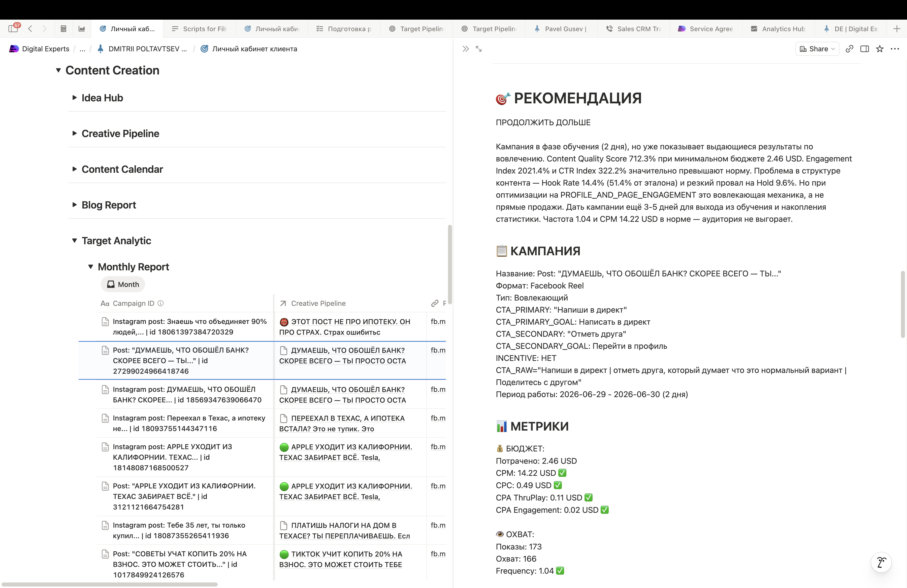

# Эффективность контента — по данным рекламного кабинета Facebook

> Всё ниже — **сырые метрики Facebook**, где можно — со **сравнением с нормой рынка**. Вывод: контент **объективно работает** — кликается выше нормы отрасли, удерживает внимание, строит аудиторию.

---

## 1. Кликабельность — выше нормы и по недвижимости, и по финансам

CTR (доля кликнувших от увидевших) — метрика, которую можно честно сравнить с рынком:

| | CTR |
|---|---:|
| **Наши рилы** | **~3%** |
| **Наши карусели** | **~5,3%** |
| Норма **Real Estate** (США, 2025) | 1,68% |
| Норма **Finance & Insurance** (США, 2025) | 0,98% |

Ипотека сидит на стыке этих двух ниш — и мы **выше нормы обеих**: рилы кликают почти **вдвое** чаще нормы недвижимости и **втрое** чаще нормы финансовой рекламы; карусели — **втрое** выше недвижимости и **в 5 раз** выше финансов. А [обе эти ниши — из самых «тяжёлых на клик» на рынке (Real Estate 1,68%, Finance & Insurance 0,98%)](research-appendix.md#11-бенчмарки-кликабельности-и-охвата-контента).

---

## 2. Наш контент удерживает внимание

Важно, **что именно мы меряем**: это не рекламные объявления, а **экспертные контентные ролики** про ипотеку в платном продвижении на **нашу аудиторию прогрева**. Это русскоязычное комьюнити, в котором есть и тёплые (подписчики и те, кто уже встречал наши ролики), и холодные, которых мы постоянно **добавляем в этот пул**. Так и устроен прогрев: для кого-то ролик — пятое касание, для кого-то — первое; своих мы греем дальше, новых — втягиваем.

**Как читать цифры удержания.** В ленте видео запускается автоматически у всех подряд, а решение «смотреть или листнуть дальше» человек принимает в первые секунды — поэтому кривая удержания у **любого** видео круто падает в самом начале. Это физика ленты, а не свойство ролика. Настоящий вопрос другой: **какая доля осознанно остаётся слушать эксперта — и остаётся ли аудитория с нами от касания к касанию.** У нас — по ~300 замерам за 3 месяца (по июню данных ещё нет):

| Показатель | Доля наших рилов | Что это значит |
|---|---:|---|
| Hook ниже 5% («мёртвый» ролик) | **0%** | ни один ролик не провалился на старте |
| Hook ≥ 15% | **85%** | 6 из 7 роликов проходят фильтр первых секунд |
| Досмотр ≥ 5% | **70%** | большинство роликов дослушивают почти до конца |
| Вовлечённость ≥ 40% | **91%** | контент вызывает реакцию, а не пролистывается |

В среднем по линейке Hook Rate **21,5%**: **из каждых 100 человек, у которых ролик заиграл в ленте, 21 проходит первые секунды и остаётся слушать монолог про ипотеку.** Досмотр **7%** — каждый четырнадцатый дослушал этот монолог **до конца**. И это устойчиво от ролика к ролику: аудитория **не выгорает от повторных касаний** — а через эти же ролики в пул постоянно заходят и подписываются новые люди (см. §4). Ровно то, что и должен делать контент на прогреве: **держать своих и цеплять новых.** Единичные слабые ролики (Hook <10%) — в основном «Direct»-кампании под сообщения, где досмотр и не был целью.

А верх линейки бьёт значительно выше:
- «Списал налоги — купить дом сложнее» — досмотр **17%** на сценарном ролике в 48 секунд; «Купил дом мечты…» — досмотр **15%**;
- твои короткие ролики, которые вы записали без наших сценариев (~16–20 сек), — «Одобрили — не значит купил» (досмотр **17%**) и «Ты уже мог жить в своём доме» (**19%**) — о них отдельно в §3.4.

*(Для экспертного контента в твоей нише досмотр 15–19% — это очень сильно.)*

Важно: сильные ролики — не случайные удачи на фоне серой массы. **Планку держит вся линейка** — 0 провалов на ~300 замеров, 85% выше порога внимания.

---

## 3. Тестирование заходов — почему кажется, что «снимаем одно и то же»

Всё это время тестирование шло **в рамках гипотез**: на одну гипотезу (одну боль аудитории) мы делаем **разные темы, разные заходы, разные подачи** — и замеряем каждый. Отсюда и ощущение «снимаем одно и то же»: **гипотеза одна — заходы разные**. Со стороны ролики похожи, а в данных это разные смысловые конструкции с разными результатами.

Цикл такой: гипотеза → несколько заходов на неё (тема / боль / подача) → каждый запускаем дешёвым тестом (обычно **~$10, 5–6 дней**) → снимаем **посекундную карту смыслов** → сильные заходы оставляем в работе, слабые отсекаем. Это не «повтор» — это перебор заходов с чтением данных между ними.

### 3.1. За каждым роликом — посекундный разбор

По каждому креативу мы строим не «понравилось / не понравилось», а структурный разбор:

- **рекомендация** — продолжать / масштабировать / остановить;
- **динамика по дням** — как ролик ведёт себя день за днём, не выгорает ли (частота показов);
- **воронка сообщений** — клик → начатый диалог → 1-й ответ → 2-й → 3-й, чтобы видеть, **где именно рвётся разговор**;
- **посекундная карта смыслов** — ролик раскладывается на смысловые блоки (боль → причина → снятие возражения → предложение → доверие), и по каждому блоку замеряется, сколько людей он удержал. Мы видим не «какая фраза понравилась», а **какой смысл держит внимание — и на каком смысле люди уходят**.

Вот такая карта для одного из сильнейших сценарных роликов — **«Списал налоги — ок. Купить дом — может быть сложнее»** (48 секунд; месячный срез 03–09.04, $11,83). Сценарий сделан по классике: рабочий заход, хороший результат, без рекламных вставок на удержании. Текст и тайминги сверены с самим роликом:

| Момент | Удержание | Какой смысл отрабатывает | Как звучит в ролике |
|---|---:|---|---|
| Обложка | — | боль + обещание выхода | «БАНК ОТКАЗАЛ? ЕСТЬ ВЫХОД» |
| 0–5 сек (вход) | — | парадокс самозанятого: налоги сэкономил — ипотеку не дали | «Платишь тысячу долларов налога с дохода в сто пятьдесят тысяч — и ходишь довольный. Ну, до того момента, когда решишь купить дом» |
| ~12 сек (крючок) | **26,3%** | история, в которой зритель узнаёт себя + легальность | «Михаил, дальнобойщик из Чикаго, зарабатывает 120–150 тысяч в год. Списывает ремонты и прочее. На бумаге почти нищий — закон позволяет, Михаил доволен» |
| ~24 сек (удержание) | **23,7%** | эскалация: система бьёт за «правильное» поведение | «Банк смотрит декларации, видит двадцать тысяч дохода — отказывает. Второй отказывает. Третий не стал даже разговаривать» |
| ~36 сек (середина) | **21,7%** | решение + снятие страха «серой схемы» | «Я не трогаю его декларации — я смотрю на входящие деньги на счёт. Это называется bank statement loan. Большинство банков о ней молчит» |
| ~46 сек (финал) | **16,8%** | хэппи-энд, зеркало для зрителя + CTA | «Михаил получил свой дом, очень доволен. Узнал себя в этой ситуации — напиши в личку, подскажу, что делать» |
| 48 сек | **11,8%** | досмотр до последнего кадра | — |

И под каждым числом — понимание, *почему* оно такое: **какой смысл и форма удержали людей, а какие начали терять**. Смотри, что видно по этой карте: **кто прошёл вход — остаётся почти весь** (26,3% → 23,7% → 21,7%: на каждом шаге удерживается 90%+) — история Михаила и решение работают. Слабое звено — **вход**: разбор прописал для следующего сценария начинать не с рассуждения, а с вопроса-парадокса «Зарабатываешь $150k, а банк видит $20k?». Эти карты — накопленный рабочий материал для этапа докрутки, к которому мы переходим (§3.5).

### 3.2. Одна гипотеза — два захода: Pre-Approval

Гипотеза Г1 «сначала брокер / Pre-Approval». Два сценарных захода с разницей в неделю: та же площадка, та же цель оптимизации. Тексты и тайминги сверены с самими роликами. Разбор — на роликах, где в части удержания сценарий переходит на рекламу: это даёт слабый досмотр. Показываем их специально — чтобы не создалось впечатления, что 3% — наш рабочий результат.

**Заход 1 — через процесс: «Банковский Pre-Approval — это просто бумажка»** (38 секунд; 30.03–04.04):

| Момент | Удержание | Какой смысл отрабатывает | Как звучит в ролике |
|---|---:|---|---|
| Обложка | — | боль-парадокс | «БАНК ОДОБРИЛ? ЭТО ЛОВУШКА» |
| ~9 сек (крючок) | **20,1%** | проблема: одобрение без проверки рассыпается | «Банк выдаёт pre-approval за 30 секунд, без глубокой проверки документов. А потом на underwriting всплывают детали — и сделка рассыпается» |
| ~19 сек (удержание) | **9,1%** | контраст «от банка vs от меня» — декларацией | «Pre-approval от банка и pre-approval от меня — это не одно и то же. Банки берут стандарт и подгоняют под него клиента» |
| ~28 сек (середина) | **5,3%** | глубина работы | «Я действую наоборот: сначала работаю с файлом — иногда это 30–50–70 документов» |
| ~36 сек (финал) | **3,6%** | CTA | «Если покупаете дом впервые — напишите в директ до того, как начнёте искать» |

Замер: **CTR 3,7%**. Карта показывает: вход рабочий, но на переходе к рекламе себя теряется больше половины зрителей (20% → 9%). Гипотеза рабочая, вход рабочий, потеря удержания на рекламе — ожидаемая, и с этим можно работать: **идёт в хаб данных на следующий этап**.

**Заход 2 — через риелторов и цифры: «Твой Pre-Approval ничего не стоит»** (47 секунд; 09–15.04):

| Момент | Удержание | Какой смысл отрабатывает | Как звучит в ролике |
|---|---:|---|---|
| ~12 сек (крючок) | **19,6%** | масштаб проблемы чужими глазами | «Крупные банки рассылают pre-approval'ы тысячами — онлайн, без документов, за 5 минут. Риелторы хорошо знают цену таким письмам» |
| ~24 сек (удержание) | **10,8%** | погружение вместо декларации | «Когда я выдаю pre-approval, я погружаюсь в кейс так, будто завтра уже клоузинг: доходы, налоги, кредит, источники down payment — проверяем всё» |
| ~36 сек (середина) | **5,7%** | арбитр со стороны + цифры-доказательства | «Риелторы, с которыми я работаю, говорят: если письмо от Димы — берём оффер без вопросов. Мой личный рекорд — один день. В среднем — 21» |
| ~45 сек (финал) | **3,7%** | CTA с выгодой | «Если хотите, чтобы ваш оффер воспринимался всерьёз, — напишите в директ до того, как начнёте искать дом» |

Замер: удержание такое же — а **CTR 6,6%: кликов ×1,8**. Этот заход почти **в два раза эффективнее**. А на рекламной части «себя любимого» — точно такой же отвал, как и в первом ролике: ожидаемый.

**Это и есть тестирование заходов:** два разных прочтения одной гипотезы — и данные показали, какое из них работает на действие. Заход 2 остаётся в работе.

### 3.3. Карта показывает, что чинить: «Банк отказал за год»

Гипотеза Г3 «нестандартная ситуация / банк отказал». Сценарный ролик, 42 секунды (13–18.05):

| Момент | Удержание | Какой смысл отрабатывает | Как звучит в ролике |
|---|---:|---|---|
| Обложка | — | боль + обещание | «ОТКАЗ В ИПОТЕКЕ? ЭТО РЕШАЕМО» |
| ~10 сек (крючок) | **18,7%** | боль с виновником | «Американский банк отказал в ипотеке, потому что работаешь в США меньше двух лет?.. Wells Fargo, Chase, Bank of America видят меньше двух лет стажа — и закрывают кейс» |
| ~21 сек (удержание) | **12,3%** | законная лазейка | «Федеральные требования действительно говорят про два года работы, но там написано кое-что ещё… я могу использовать твой доход из страны исхода. Это законно» |
| ~31 сек (середина) | **6,4%** | кейс-доказательство | «Виктор — IT-специалист из Алматы. Год работает в США в той же сфере. В банке отказ — у меня pre-approval и покупка» |
| ~40 сек (финал) | **4,5%** | CTA | «Если вам уже отказали — напишите в директ. Возможно, вы просто пришли не к тому специалисту» |

Что видит карта: самое сильное место ролика — **живой кейс Виктора — стоит на 29-й секунде, куда доживает 6% зрителей**. Это готовая правка для следующего сценария по гипотезе: кейс — в начало. Ровно такие правки — следующий этап (§3.5).

### 3.4. Короткие ролики, записанные без наших сценариев

Это ролики по нашим темам и гипотезам, но записанные без сценарной проработки. По абсолютному досмотру они на уровне лучших: «Одобрили — не значит купил» **17%**, «Ты уже мог жить в своём доме» **19%**.

Но читать эти цифры надо с учётом длины:

- твои ролики — **16–20 секунд**,
- сценарные — **40–50 секунд**.

Короткий ролик досматривают лучше по определению: досмотр 16–20-секундного должен быть **в 2–3 раза выше**, чем у сценарного. А он такой же — 17–19% против 17–19%. Причина видна в самих роликах: тема от рабочих гипотез (мы её и тестируем, так что всё по плану), а **удержание провисает** — в 16–20 секунд смыслам не хватает места: негде раскрыть, конструкция получается рваной. По кликам короткие ролики тоже провисают: CTR твоих — 0–1,7%, сценарных — 2–6,6%. Это обычная история, мы с этим постоянно сталкиваемся; моя гипотеза — она связана не только с качеством входа, но и с работой Fb: они не любят технической накрутки за счёт короткого формата и режут. Так или иначе, **короткий формат проигрывает в экспертном контенте**.

«Снимайте короткие ролики» — популярный совет на маркетинговых курсах. Но это **совет от слабости**: короткое снять проще, чем проработать сценарий, который удерживает внимание почти минуту, — и он маскирует провисание смысловой части.

С описаниями к роликам мы, конечно, работаем — это та же работа со смыслами (заход, снятие возражения, действие), только в тексте поста. Вот живой пример — твой ролик про отказ банка.

**Текст ролика (как записан):**

> «Банк сказал „нет“. Прекрасно. Значит, пришло время поговорить со мной. У банка три программы, у меня 250. Он искал причину отказать, я ищу способ одобрить. Пиши программу, подберём для тебя.»

**Описание, которое мы к нему собрали:**

> «БАНК СКАЗАЛ «НЕТ»? ЭТО НЕ ПРИГОВОР. ЭТО ПРОСТО НЕ ТА ДВЕРЬ. У банка три программы. У меня 250. Банк искал причину отказать — я ищу способ одобрить. Разница простая: банк подгоняет тебя под систему, я ищу систему под тебя. Всё в рамках закона, без фокусов. Если тебе уже отказали или ты не уверен, что вообще подойдёшь — напиши мне в директ, разберёмся в твоей ситуации. Бесплатно, без обязательств.»

Что добавлено на уровне смыслов: **метафора-рамка** («не та дверь» — отказ перестаёт быть приговором и становится неправильным адресом), **развёрнутый контраст систем** («банк подгоняет тебя под систему — я ищу систему под тебя»), **снятие страха серых схем** («в рамках закона, без фокусов») и **CTA со снятым барьером** («не уверен, что подойдёшь» + «бесплатно, без обязательств» — закрывает страх «а вдруг я не пройду»). Ролик бьёт коротко — описание доносит смысловую конструкцию целиком. Они работают в паре.

И вся эта аналитика — не закрытая кухня. В твоём **личном кабинете** отчёты по контенту подтягиваются **в режиме реального времени** — можно в любой момент открыть и посмотреть, как идут дела. Это наш рабочий инструмент, с которым мы работаем каждый день: в разделе **Month** — отчёты за месяц, в **Builder** — текущая ежедневная аналитика, скользящий отчёт за 7 дней по каждой кампании, с ним таргетолог работает ежедневно.

<i>Личный кабинет: слева — кампании месяца, справа — живой разбор ролика, который подтянулся по свежей кампании.</i>

### 3.5. Что дальше: докрутка внутри сценария

До этого этапа мы плавно дошли только сейчас, потихоньку начинаем — сначала тестируются гипотезы и заходы, потом настройка вглубь, параллельно с лидгеном. Карты смыслов по гипотезам накоплены: видно, что держит, что проседает и где рвётся. Следующий шаг — брать **проверенные заходы** и точечно перестраивать конструкцию внутри сценария, переделывать блоки (пример готовой правки — кейс Виктора в начало, §3.3).

Можно ли было всё это сделать быстрее? Наверное, да. Цена — **кратно больше денег на трафик и ниже эффективность**. Большие бренды проходят путь тестирования гипотез быстрее (наверное — я не уверен), но у них и бюджеты, и команды побольше.

Для тебя это, как ни странно, станет **легче**: контента нужно меньше, а темы будут разнообразнее — вместо пачек похожих заходов по одной гипотезе идут точечные правки проверенных сценариев. И это не всегда делается в рамках одной темы. В общем, попроще будет, если будем работать. И у нас появляется пространство в сетке для **контента на вовлечение** — мы уже начали это делать. Тебе вроде темы понравились, ты писал.

---

## 4. Контент построил реальный актив

За март–май (без июня) контент собрал измеримую базу:

- охват **~114 000** человек, **+931 подписчик** (по отчёту таргетолога);
- **27 начатых переписок → 13 глубоких диалогов** (см. основной отчёт);
- переписка из контента обходилась в **$2–5** — то есть внимание конвертируется дёшево.

---

## Главное

1. **Кликают выше нормы и по недвижимости, и по финансам** (рилы ~3%, карусели ~5,3% против 1,68% Real Estate и 0,98% Finance & Insurance, США 2025).
2. **Контент удерживает внимание** — 0 «мёртвых» рилов, 85% с Hook ≥ 15%.
3. **Контент строит актив** — охват 114K, +931 подписчик, 27+ переписок по $2–5.
4. **«Одно и то же» — это тестирование разных заходов на одну гипотезу.** Этот этап пройден; дальше — докрутка внутри сценария: контента меньше, темы разнообразнее.
